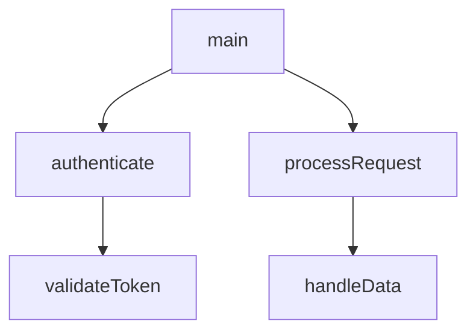

# GhidraGraph Plugin

Advanced call graph visualization and export plugin for Ghidra with support for multiple export formats including Mermaid.js.

## Features

### Graph Generation
- **Bidirectional Analysis**: Generate graphs showing both calling and called functions
- **Depth Control**: Configure traversal depth (1-10 levels)
- **Cycle Detection**: Handles recursive function calls gracefully
- **Function Filtering**: Filter by name patterns or address ranges

### Export Formats
- **Mermaid.js**: Markdown-compatible flowcharts (GitHub/GitLab rendering)
- **DOT/Graphviz**: Industry-standard graph format
- **JSON**: Machine-readable graph data

### Integration
- **Context Menu**: Right-click on any function → "Export Call Graph"
- **Interactive Viewer**: Native Ghidra graph display with zoom/pan
- **Batch Export**: Export multiple function graphs via scripts
- **Auto-Analysis**: Optional analyzer for automatic graph generation

## Installation

1. Download the GhidraGraph extension ZIP file
2. In Ghidra: **File** → **Install Extensions**
3. Click the **+** icon and select the downloaded ZIP
4. Restart Ghidra
5. Verify installation: **File** → **Configure** → **Miscellaneous** → Check **GhidraGraphPlugin**

## Usage

### Basic Usage
1. Open a program in Ghidra's CodeBrowser
2. Navigate to a function
3. Right-click → **Export Call Graph**
4. Configure options:
   - **Direction**: Calling, Called, or Both
   - **Max Depth**: 1-10
   - **Format**: Mermaid, DOT, or JSON
5. Click **Generate**

### Advanced Features
- **Filter Functions**: Use regex patterns to include/exclude functions
- **Custom Styling**: Configure colors and shapes via GraphDisplayOptions
- **Batch Processing**: Use Ghidra scripts for automated graph generation

## Building from Source

```bash
export GHIDRA_INSTALL_DIR=/path/to/ghidra
cd GhidraGraph
gradle buildExtension
```

The built extension will be in `dist/`.

## Technical Details

- **Language**: Java 17+
- **Ghidra Version**: 11.4.2+
- **Dependencies**: Ghidra's service.graph API
- **License**: Apache License 2.0

## Examples

### Mermaid Output


## Support

For issues or feature requests, please use the project's issue tracker.

## License

Apache License 2.0 - See LICENSE file for details.
