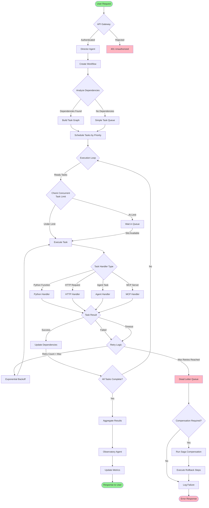
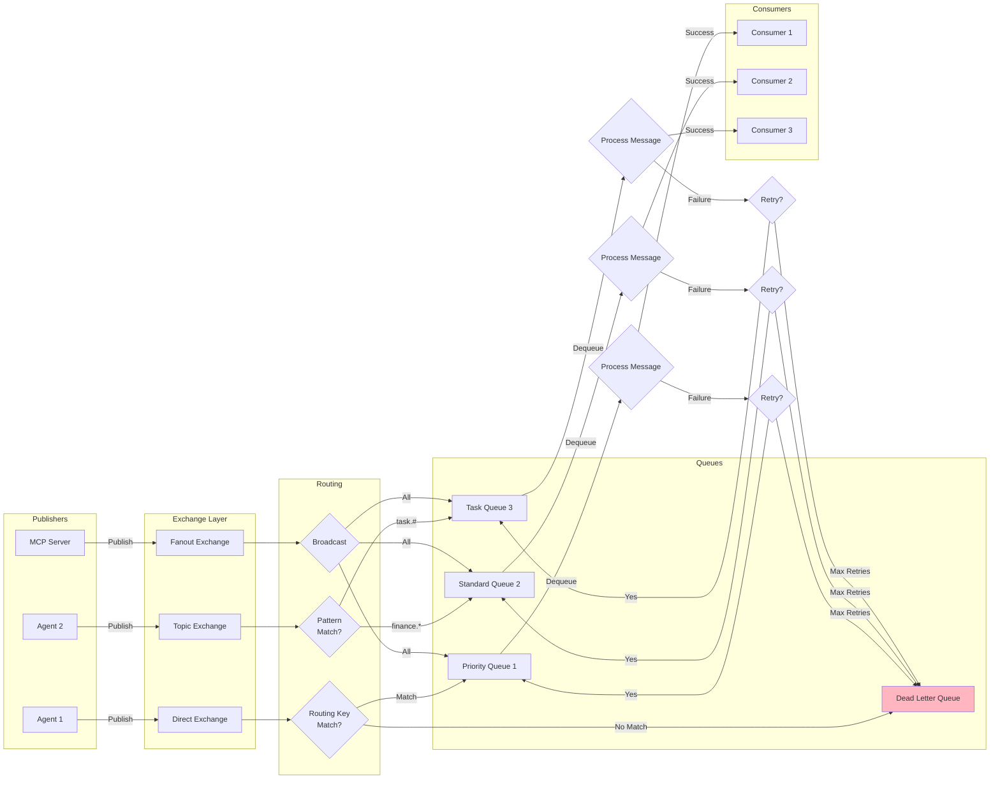
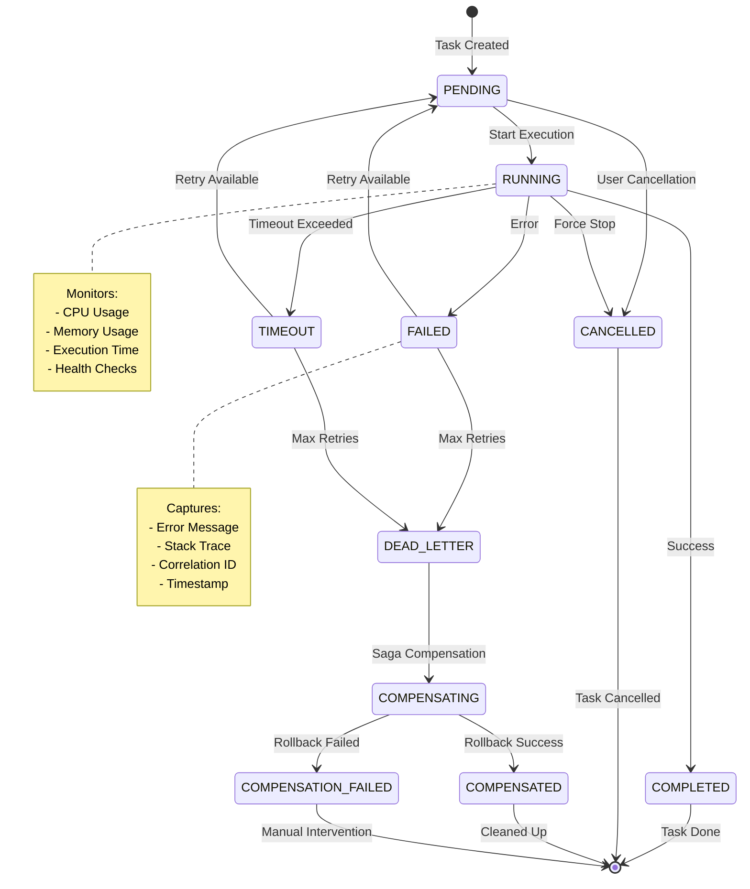
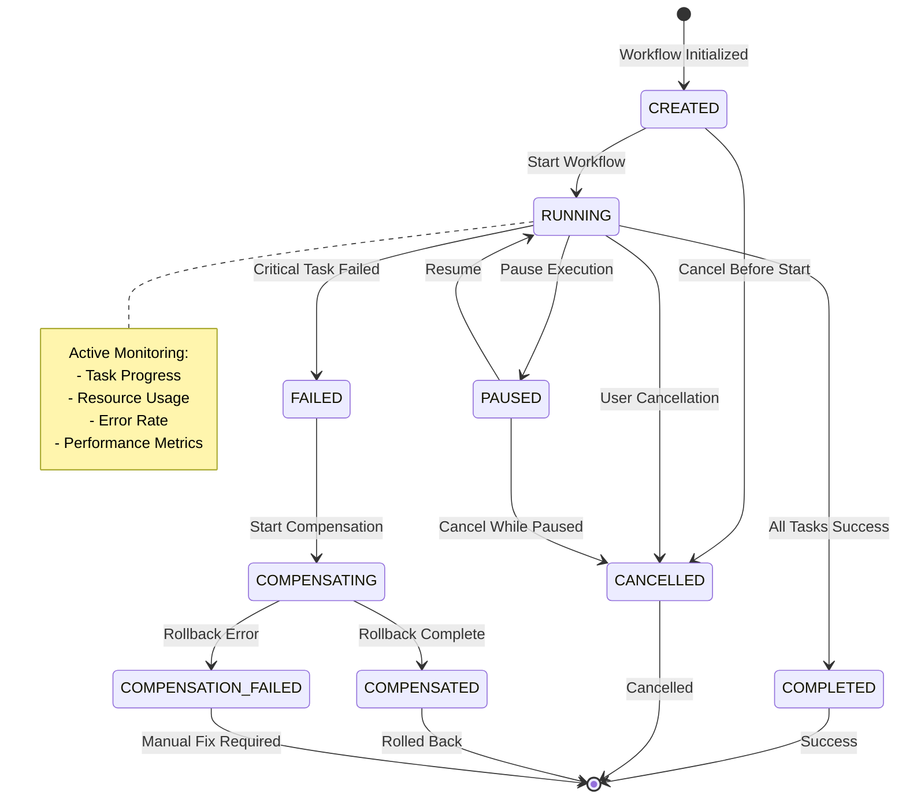
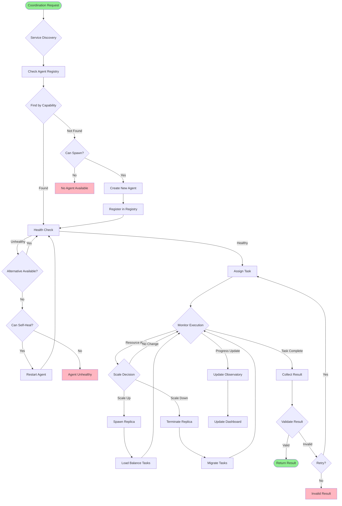
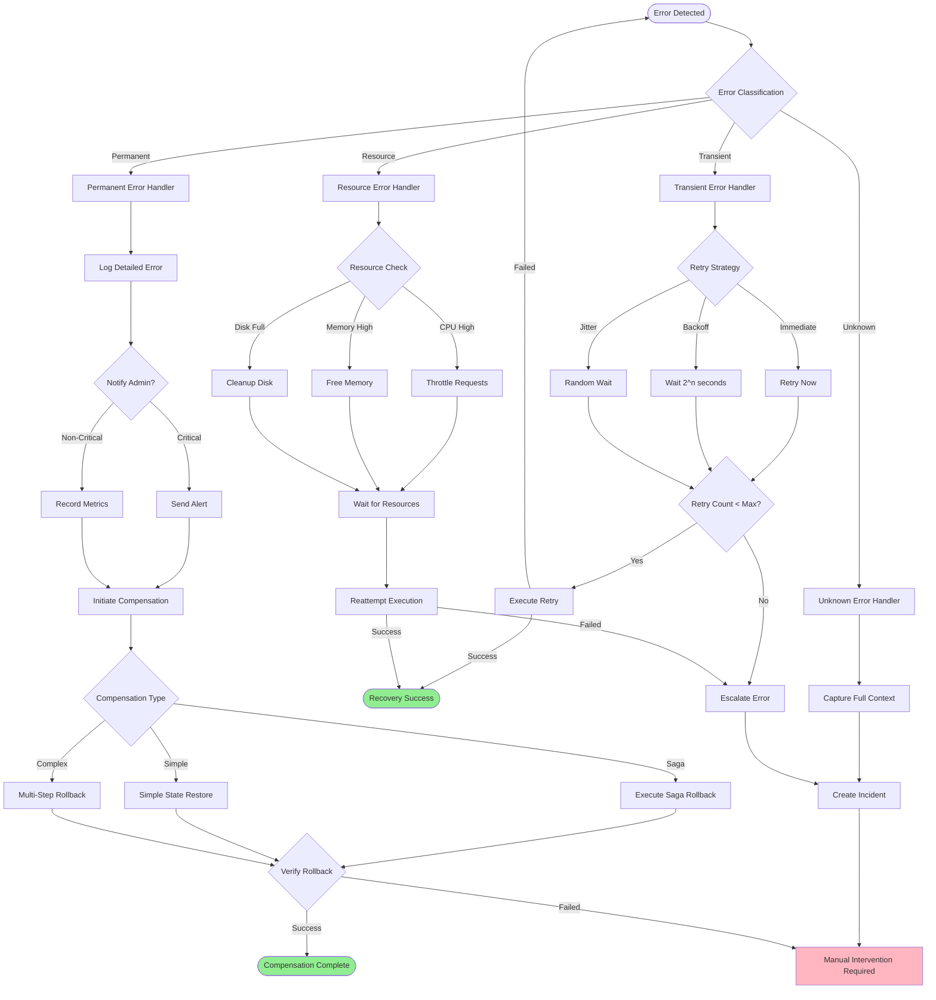
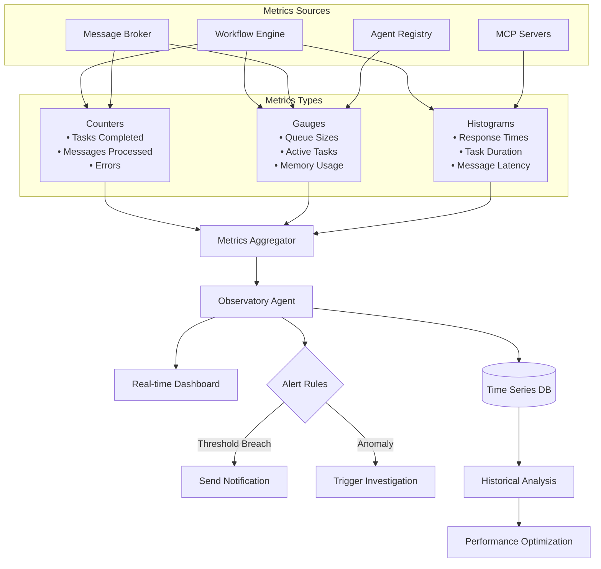

# Process Control Flow Diagram

## Main Orchestration Flow



## Message Queue Event Flow



## Task State Machine



## Workflow State Machine



## Agent Coordination Flow



## Error Handling & Recovery Flow



## Priority-Based Task Scheduling

```mermaid
flowchart LR
    subgraph Task Queue
        Critical[CRITICAL Tasks<br/>Priority: 3]
        High[HIGH Tasks<br/>Priority: 2]
        Normal[NORMAL Tasks<br/>Priority: 1]
        Low[LOW Tasks<br/>Priority: 0]
    end
    
    subgraph Scheduler
        Select{Select Next Task}
        CheckDeps{Dependencies<br/>Satisfied?}
        CheckResources{Resources<br/>Available?}
    end
    
    subgraph Execution Pool
        Slot1[Executor 1]
        Slot2[Executor 2]
        Slot3[Executor 3]
        SlotN[Executor N]
    end
    
    Critical --> Select
    High --> Select
    Normal --> Select
    Low --> Select
    
    Select -->|Priority Order| CheckDeps
    CheckDeps -->|Yes| CheckResources
    CheckDeps -->|No| Select
    
    CheckResources -->|Yes| AssignSlot{Assign to Slot}
    CheckResources -->|No| WaitResources[Wait for Resources]
    
    AssignSlot --> Slot1
    AssignSlot --> Slot2
    AssignSlot --> Slot3
    AssignSlot --> SlotN
    
    Slot1 -->|Complete| ReleaseSlot[Release Slot]
    Slot2 -->|Complete| ReleaseSlot
    Slot3 -->|Complete| ReleaseSlot
    SlotN -->|Complete| ReleaseSlot
    
    ReleaseSlot --> Select
    WaitResources --> Select
    
    note right of Critical
        Examples:
        - Security incidents
        - System failures
        - Data corruption
    end note
    
    note right of Normal
        Examples:
        - Regular processing
        - Standard requests
        - Routine tasks
    end note
```

## Performance Metrics Collection



## Key Process Control Points

| Control Point | Decision Logic | Actions | Recovery |
|--------------|----------------|---------|----------|
| **Authentication** | Valid credentials? | Allow/Deny access | Log attempt, block IP after failures |
| **Task Dependencies** | All dependencies met? | Execute/Wait | Re-evaluate on completion |
| **Concurrency Limit** | Under max concurrent? | Execute/Queue | Release slots on completion |
| **Retry Logic** | Retry count < max? | Retry/Abandon | Exponential backoff, dead letter |
| **Health Check** | Service healthy? | Use/Skip | Attempt healing, find alternative |
| **Resource Availability** | Resources sufficient? | Proceed/Wait | Scale up, throttle, or queue |
| **Compensation** | Rollback required? | Compensate/Log | Manual intervention if fails |
| **Priority Scheduling** | Higher priority exists? | Preempt/Continue | Requeue preempted tasks |

## Process States Summary

| Layer | States | Transitions | Terminal States |
|-------|--------|-------------|-----------------|
| **Task** | PENDING, RUNNING, COMPLETED, FAILED, CANCELLED, TIMEOUT | 7 transitions | COMPLETED, CANCELLED, DEAD_LETTER |
| **Workflow** | CREATED, RUNNING, PAUSED, COMPLETED, FAILED, CANCELLED | 8 transitions | COMPLETED, CANCELLED, COMPENSATED |
| **Message** | PENDING, PROCESSING, COMPLETED, FAILED, DEAD_LETTER | 6 transitions | COMPLETED, DEAD_LETTER |
| **Agent** | INACTIVE, INITIALIZING, ACTIVE, DEGRADED, FAILED | 6 transitions | TERMINATED |

## Process Optimization Points

1. **Parallel Execution**: Tasks with no dependencies run concurrently up to limit
2. **Priority Queuing**: Critical tasks preempt normal tasks
3. **Connection Pooling**: Reuse connections for HTTP and database operations
4. **Circuit Breaker**: Fail fast on repeated failures to prevent cascade
5. **Bulkhead Pattern**: Isolate failures to prevent system-wide impact
6. **Saga Pattern**: Ensure consistency in distributed transactions
7. **Event Sourcing**: Maintain audit trail and enable replay
8. **Caching**: Reduce repeated computations and external calls